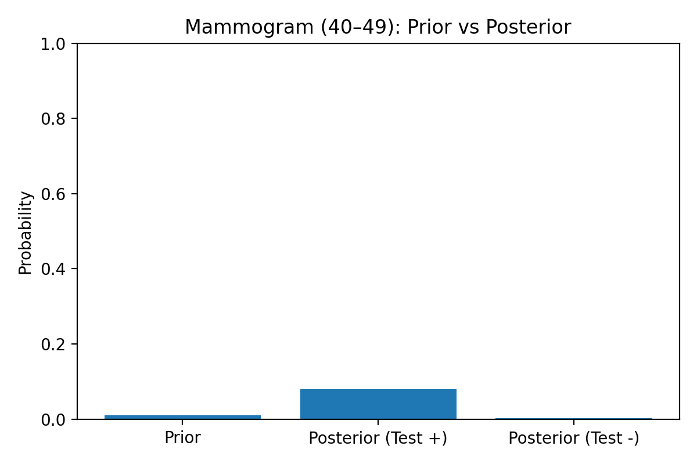
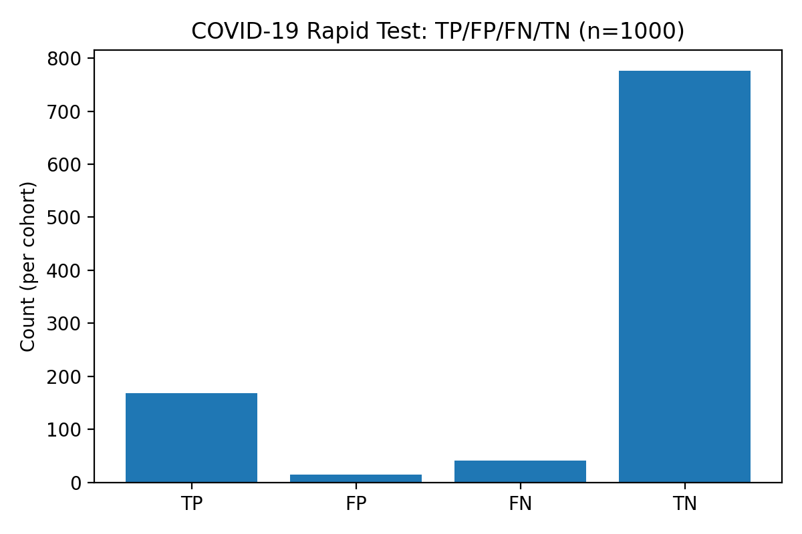

# Bayesian Diagnostics: Medical Decisions under Uncertainty
*A mini project exploring how Bayesian reasoning improves medical decision-making under uncertainty — part of my AI Safety & Ethics portfolio.*

---

## Table of Contents  
- [1. Theory & Contingency Tables](#1-theory--contingency-tables)  
- [2. Simulation & Plots](#2-simulation--plots)  
- [3. Storytelling & Ethical Narrative](#3-storytelling--ethical-narrative)  

---

## 1. Theory & Contingency Tables

### Introduction
Medical diagnostics are one of the clearest examples of how statistical uncertainty shapes critical decisions. No test is perfect: there will always be false positives and false negatives. This means that doctors, patients, and healthcare systems must update their beliefs as new evidence emerges, making choices based on probabilities rather than absolute certainty.

This dilemma mirrors what happens in artificial intelligence: machine learning models also operate under uncertainty and limited accuracy, requiring decision-makers to understand risks before placing full trust in their outputs. By studying medical diagnostics through Bayesian tools, we can not only see how probabilities shift with new evidence, but also reflect on governance and accountability in systems that directly impact human lives.

---

## Key Terms

**Sensitivity**  
The probability that a test correctly identifies a person who actually has the disease.  
- High sensitivity → few false negatives.  
- Example: A COVID-19 test with 95% sensitivity will correctly detect 95 out of 100 infected patients.  

**Specificity**  
The probability that a test correctly identifies a person who does not have the disease.  
- High specificity → few false positives.  
- Example: A mammogram with 90% specificity will correctly reassure 90 out of 100 healthy patients.  

**Prevalence**  
The proportion of people in a population who have the disease at a given time.  
- Strongly affects how useful a test result is.  
- Example: A rare disease (low prevalence) means most positive results could actually be false positives.  

**Prior Odds**  
The probability of disease before the test result, expressed as odds rather than percentages.  
- Derived from prevalence or other prior knowledge.  
- Example: If prevalence is 1 in 100, the prior odds are 1:99.  

**Likelihood Ratio (LR)**  
A measure of how much a test result changes the odds of disease.  
- **Positive LR (LR+)** = Sensitivity ÷ (1 – Specificity) → how much odds increase after a positive test.  
- **Negative LR (LR–)** = (1 – Sensitivity) ÷ Specificity → how much odds decrease after a negative test.  
- Example: An LR+ of 10 means a positive test makes the disease 10 times more likely compared to before testing.  

---

## Case 1: Mammogram for Breast Cancer (women aged 40–49)

- **Prevalence:** ~1% (about 1 in 100 women in this age group has breast cancer).  
- **Sensitivity:** ~85% (the test catches 85% of true cases).  
- **Specificity:** ~90% (10% false positives).  

These numbers are often quoted in teaching examples (the “mammography paradox”), and they make Bayesian reasoning very clear: with such a low prevalence, most positives are still false alarms.

---

## Case 2: Rapid Antigen Test for COVID-19 (high-prevalence outbreak)

- **Prevalence:** ~20% (e.g., in a high-exposure group at peak outbreak).  
- **Sensitivity:** ~80% (rapid tests miss some cases, especially in early infection).  
- **Specificity:** ~98% (few false positives).  

These values are consistent with CDC/WHO reports during the pandemic. The contrast here is interesting: prevalence is high, so even a modest sensitivity still produces useful results, but false negatives become a real risk.

---

## Case 1 — Screening Mammogram: Contingency Table

**Assumptions (illustrative but realistic):**  
Prevalence = 1%, Sensitivity = 85%, Specificity = 90%.  

### Contingency Table (per 1,000 screened)

|                      | **Test +** | **Test –** | **Total** |
|----------------------|-----------:|-----------:|----------:|
| **Disease (1%)**     | **8.5** TP | **1.5** FN | 10        |
| **No disease (99%)** | **99** FP  | **891** TN | 990       |
| **Total**            | 107.5      | 892.5      | 1,000     |

### Key Metrics  

- **PPV (Positive Predictive Value)** = 8.5 / (8.5 + 99) ≈ **7.9%**  
- **NPV (Negative Predictive Value)** = 891 / (891 + 1.5) ≈ **99.8%**  
- **LR+ (Positive Likelihood Ratio)** = Sens / (1 – Spec) = 0.85 / 0.10 = **8.5**  
- **LR– (Negative Likelihood Ratio)** = (1 – Sens) / Spec = 0.15 / 0.90 ≈ **0.167**  
- **Posterior probability after positive test** ≈ **7.9%**  

___

**Interpretation**  
Even with a reasonably accurate test, the very **low prevalence** of breast cancer in this age group means that most positive results are false alarms. This is the classic “mammography paradox.” Bayesian reasoning highlights that the **base rate** is just as important as test accuracy when interpreting medical results.  

From an AI ethics perspective, this shows why **accuracy alone can be misleading** — in both medicine and machine learning, context and prevalence strongly shape decision quality.  
___

## Case 2 — Rapid Antigen Test for COVID-19: Contingency Table

**Assumptions (illustrative but realistic):**  
Prevalence = 20%, Sensitivity = 80%, Specificity = 98%.  

### Contingency Table (per 1,000 tested)

|                      | **Test +** | **Test –** | **Total** |
|----------------------|-----------:|-----------:|----------:|
| **Disease (20%)**    | **160** TP | **40** FN  | 200       |
| **No disease (80%)** | **16** FP  | **784** TN | 800       |
| **Total**            | 176        | 824        | 1,000     |

### Key Metrics

- **PPV (Positive Predictive Value)** = 160 / (160 + 16) ≈ **90.9%**  
- **NPV (Negative Predictive Value)** = 784 / (784 + 40) ≈ **95.1%**  
- **LR+ (Positive Likelihood Ratio)** = 0.80 / 0.02 = **40**  
- **LR– (Negative Likelihood Ratio)** = 0.20 / 0.98 ≈ **0.204**  
- **Posterior probability after positive test** ≈ **90.9%**

___

### Interpretation

With **higher prevalence**, a positive antigen test is highly informative: most positives are true cases (PPV ≈ 91%).  
However, **false negatives** (40 out of 1,000) remain significant and must be managed carefully.  

This example shows how **context changes diagnostic value**: the same test that struggles in low-prevalence settings becomes reliable in high-prevalence ones.  
For AI and governance, the lesson is clear — **outputs cannot be interpreted in isolation**; decision-makers must account for prevalence, uncertainty, and limitations.

___

## 2. Simulation & Plots

- **Notebook:** [diagnostics_bayes.ipynb](diagnostics_bayes.ipynb)  
- **Figures:** see `/figures` folder for all outputs.

### Main features
- Function that calculates posterior odds and probabilities from sensitivity, specificity, and prevalence.  
- Simulation of 1,000 patients for each scenario (mammography and COVID-19 rapid test).  
- Simple matplotlib plots:
  - Prior vs Posterior probability.
  - Absolute counts of True Positives (TP), False Positives (FP), False Negatives (FN), and True Negatives (TN).

### Example outputs

**Prior vs Posterior Probability (Mammogram)**  


**Confusion Counts (COVID-19 Rapid Test)**  


___

## 3. Storytelling & Ethical Narrative

### Case Study A: Patient with a Positive Mammogram

**Narrative**  
Maria, a 45-year-old woman, goes for a routine mammogram as part of her annual health check. She feels healthy, has no major symptoms, and comes from a family with no known history of breast cancer.  
She sits anxiously in the waiting room while the technician reviews the scan. A few minutes later, she hears: *“The result is positive — you may have breast cancer.”*  

In that moment, Maria’s life feels as if it has shifted. She begins imagining the worst: chemotherapy, surgery, the impact on her children. Yet statistically, the chance she actually has cancer is still small.  

**Bayesian update**  
- Prior probability (prevalence in this age group): **1%**  
- Posterior probability after positive test: **~8%**  

**Ethical reflection**  
Maria’s story highlights the profound **psychological impact of false positives**. Even though the actual probability is less than 1 in 10, the wording *“you may have cancer”* is enough to cause fear, sleepless nights, and possibly unnecessary invasive biopsies.  

From an ethical perspective, this shows the responsibility of professionals and systems to communicate uncertainty with **clarity and compassion**. Accuracy metrics like “85% sensitivity” or “90% specificity” mean little to patients unless translated into understandable risks.  

In AI systems, similar dangers arise: a fraud detection algorithm that flags innocent users, or a hiring model that falsely excludes qualified candidates. Like Maria’s mammogram, the false positives may be numerically small but **emotionally and socially costly**. Responsible governance means anticipating these outcomes and building safeguards for those affected.  

---

### Case Study B: Patient with a Negative COVID-19 Rapid Test

**Narrative**  
John, a 30-year-old man, lives with three roommates, two of whom have just tested positive for COVID-19 during a local outbreak. He develops mild symptoms — a cough and fatigue — and decides to take a rapid antigen test at a local pharmacy. The result appears quickly: *Negative.*  

John breathes a sigh of relief. He believes he is safe, goes back to work the next day, and meets friends for dinner. A few days later, however, he develops a fever and tests positive on a PCR test. By then, he has already exposed dozens of people.  

**Bayesian update**  
- Prior probability (prevalence in high-risk group during outbreak): **20%**  
- Posterior probability after negative test: **~5%**  

**Ethical reflection**  
Even though the rapid test is “good” by statistical standards, John’s negative result carried a **non-negligible risk of being wrong**. The real danger is not the number itself, but the **false reassurance** it gave him. He acted as though he was safe, when in reality the test result needed to be interpreted with caution and ideally repeated.  

The parallel in AI is clear: imagine a self-driving car’s system giving a false “all clear” signal when a pedestrian is actually present, or a credit algorithm wrongly denying risk in a high-prevalence fraud setting. False negatives can create an **illusion of safety**, leading to dangerous consequences.  

This highlights the need for governance structures that mandate **protocols after uncertain outputs**: in medicine, retesting or combining test types; in AI, requiring human-in-the-loop review or multiple model checks.  

---

### From Medicine to AI

Both stories reveal the same lesson: uncertainty is inevitable, but **how we communicate** and act on it defines the ethical impact.  

- In low-prevalence settings (Maria’s mammogram), positive results are likely to be false alarms → parallel to AI models that over-flag rare events.  
- In high-prevalence settings (John’s rapid test), negative results are risky → parallel to AI models that under-detect critical risks.  

For both medicine and AI:  
- **Accuracy alone is insufficient.**  
- **Prevalence and context matter deeply.**  
- **Communication and governance decide whether uncertainty leads to harm or to trust.**  

This mini project demonstrates not only the math of Bayesian reasoning but its **human and societal dimension**. It illustrates why explainability, transparency, and ethical reflection must be central to deploying AI systems — the same principles that protect patients in medicine can protect users and communities in the digital age.  

___

*Final notes: running instructions, limitations, and release info.*  

---

## How to Run
1. Clone the repository:
   ```bash
   git clone https://github.com/Jaderfonseca/Medical-Diagnostics-with-Bayesian-Reasoning.git
   
2. Install dependencies:  
   `pip install numpy matplotlib`

3. Open the notebook:  
   `jupyter notebook notebooks/diagnostics_bayes.ipynb`

___

## Limitations & Future Work

Simulations use fixed sensitivity, specificity, and prevalence; real-world variation is broader.
Only two medical scenarios are included; future work could expand to additional diseases and test types.
Ethical reflections are illustrative; deeper exploration could connect to algorithmic fairness and real-world AI deployments.


